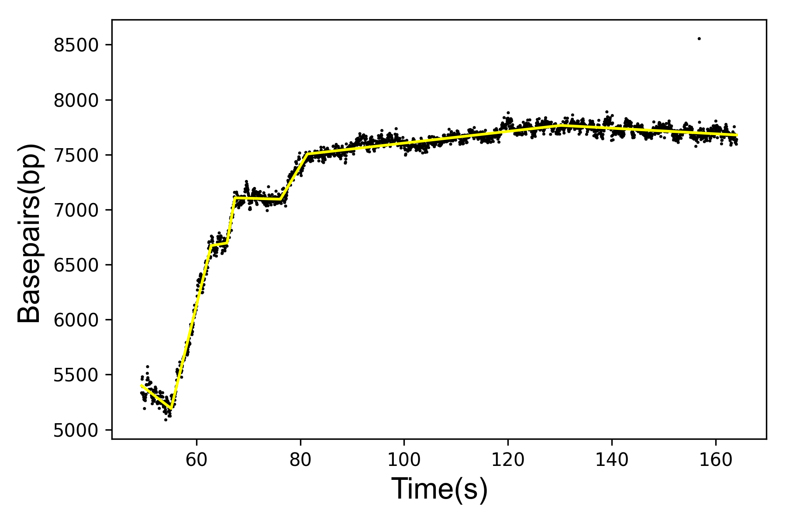
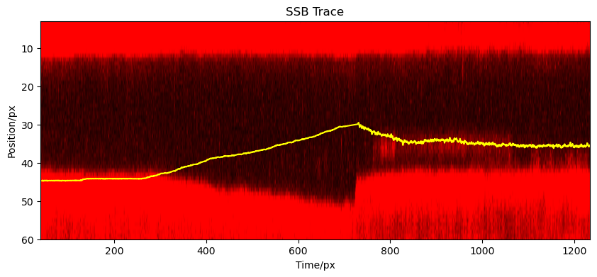
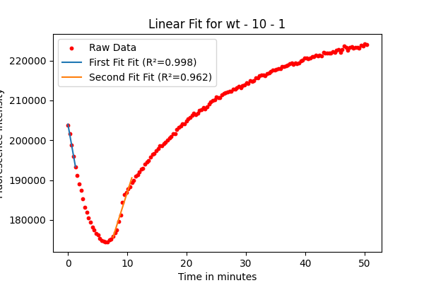

# DNA Polymerase and SSB Interaction Analysis

This repository houses a comprehensive suite of analytical tools designed to investigate the interactions between DNA polymerase and Single-Strand Binding (SSB) protein at both single-molecule and bulk assay levels. The repository is structured into three primary modules, each addressing specific aspects of DNA-protein interactions:

1. [Analyzing basepair-time traces](Analyzing_ChangePoint_SingleMolecule)
2. [Analyzing the displacement of SSB by DNA polymerase](Analyzing_DNAp_Displaces_SSB)
3. [Analyzing real-time DNA primer extension data](Analyzing_PolExo_RealTimeExtensionData)

Each module contains a detailed README file explaining the code structure, a Jupyter notebook demonstrating the analysis workflow, and exemple datasets for reproducibility purposes. For specific version requirements, Python dependencies, and quick-start guides, please refer to the README file within each module.

## 1. Change-point Detection using Single-Molecule Basepair-Time Traces

This Jupyter notebook presents a streamlined yet robust analytical pipeline for processing and interpreting DNA force-extension experiments conducted using optical tweezers. Specifically designed to handle raw experimental data in TDMS format, this notebook employs advanced polymer physics models (WLC for dsDNA, and FJC for ssDNA) to extract crucial biophysical parameters. The analysis pipeline encompasses several key components, including visualization of force-extension curves, quantification of ssDNA/dsDNA percentages catalysis by DNAp, and identification and characterization of discrete steps in DNAp processing events. 

## 2. Real-time Visualization of DNA Polymerase Displacing SSB

This module comprises three interconnected Jupyter notebooks, each addressing a specific aspect of the dynamic interplay between DNA polymerase and Single-Strand Binding (SSB) proteins. The first notebook, [Processing of force measurement data](Analyzing_DNAp_Displaces_SSB/1_CalculatingDNApTrace_OT.ipynb), focuses on the analysis and interpretation of force measurements obtained from optical tweezers experiments. The second notebook, [Observing DNA polymerase displacement of SSB in real time](Analyzing_DNAp_Displaces_SSB/2_Correlation_image_force.ipynb), correlates force measurements with fluorescence imaging data to visualize the real-time displacement of SSB by DNA polymerase. An optional third notebook, [Image processing for specific datasets](Analyzing_DNAp_Displaces_SSB/3_Correlation_force_processed_image.ipynb), provides advanced image processing techniques for specific datasets, enhancing the resolution and clarity of the DNA polymerase-SSB interaction visualization. All notebooks are designed to process data in `.tdms` format, ensuring compatibility and ease of use. When utilized in conjunction, these analytical tools offer comprehensive insights into the dynamics of DNA polymerase activity and its interaction with SSB. Each notebook includes a detailed walkthrough of the analysis process for reproducibility.

## 3. Real-time DNA Primer Extension Assay: Analyzing SSB's Effect on DNA Polymerase

This Jupyter Notebook is dedicated to the quantitative analysis of DNA polymerase (Pol) activity and its associated exonuclease (exo) function within a real-time DNA primer extension assay. The primary objective is to elucidate the modulatory effects of Single-Strand Binding protein (SSB) on both the polymerization and exonuclease activities of the enzyme. The analytical approach involves processing time-resolved fluorescence intensity data and applying linear regression models to distinct segments of the fluorescence traces. This method enables the extraction of enzyme activity rates, expressed in Relative Fluorescence Units per second (RFU/s), and their correlation with SSB concentration. 

## Road Maps

- **User Interface Development**: We aim to develop a user-friendly interface to make these analytical tools accessible to researchers without coding experience.
- **Methodological Enhancements**: We are exploring the adoption of more advanced Python-centric methodologies for data analysis, such as the [Bayesian changepoint detection for single-molecule analysis](https://github.com/longfuxu/bayesian_changepoint_detection_single_molecule).
- **High-Throughput Analysis**: We are developing scripts to efficiently handle and process large-scale datasets.

## Contributing
We welcome contributions to enhance and expand this project. Please fork the repository, make your changes, and submit a pull request. For contribution you can also contact Longfu Xu or Prof. Gijs Wuite

## Support and Contact
Please note that the code in this repository is custom written for internal lab use and still may contain bugs. For questions, support, or feedback, please contact Dr. Longfu Xu at [longfu2.xu[at]gmail.com](mailto:longfu2.xu@gmail.com). 

## Citation
Xu, L. (2023) Grab, manipulate and watch single DNA molecule replication. PhD-Thesis - Research and graduation internal. Available at: https://doi.org/10.5463/thesis.424.

## License

This project is licensed under MPL-2.0 license. See `LICENSE` file for more details.

## Acknowledgments

All codes listed in this repository are developed by Dr. Longfu Xu (longfuxu.com) during the PhD work in [Gijs Wuite Lab](http://www.gijswuite.com/). Special thanks to all contributors and supporters of this project.

