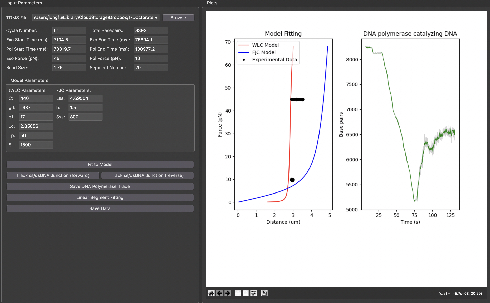
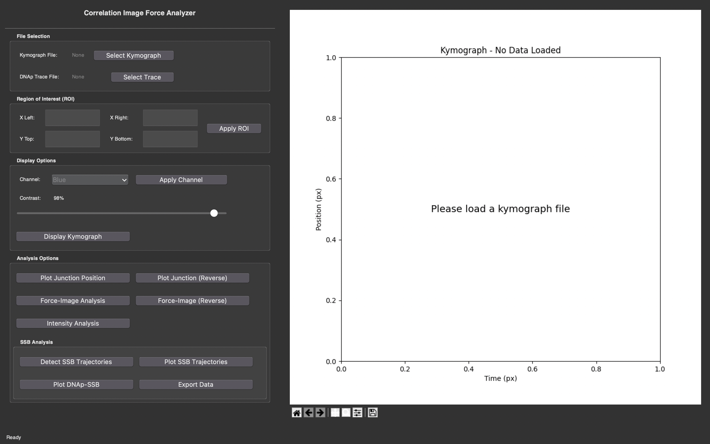
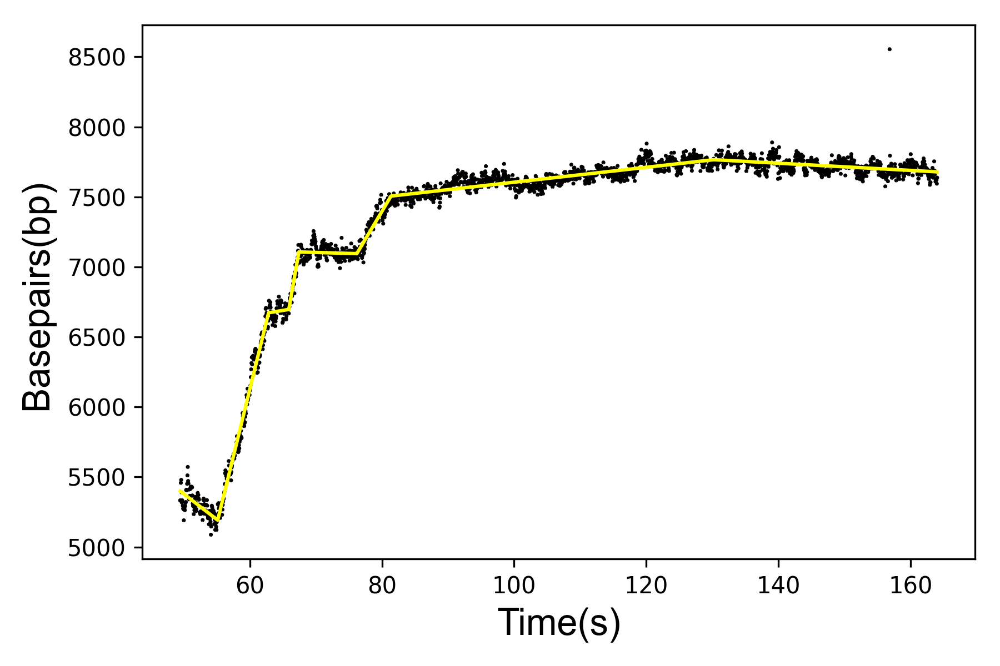
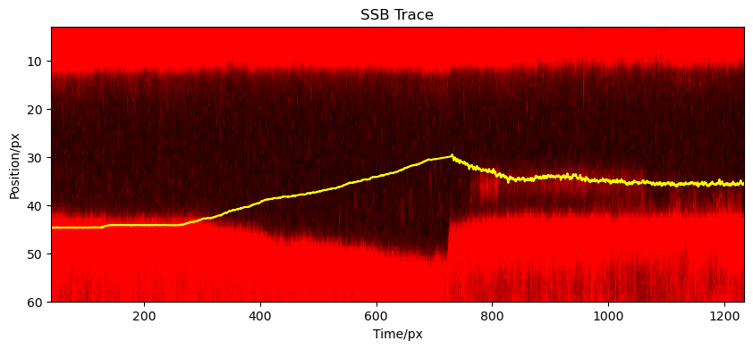
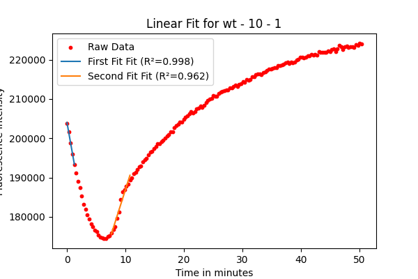

# DNA Polymerase and SSB Interaction Analysis

This repository contains the full codebase associated with our [manuscript](https://www.biorxiv.org/content/10.1101/2025.03.07.642097v1), providing a comprehensive suite of analytical tools for studying the dynamic interactions between DNA polymerase and Single-Strand Binding (SSB) proteins. The toolkit supports both single-molecule and ensemble-level analyses, enabling quantitative characterization of the mechanistic interplay between these essential components of the DNA replication machinery. 

The repository is structured into three primary modules, each addressing specific aspects of DNA-protein interactions:

1. [Analyzing basepair-time traces](Analyzing_ChangePoint_SingleMolecule) - For single-molecule analysis of DNA polymerase processivity and kinetics
2. [Analyzing the displacement of SSB by DNA polymerase](Analyzing_DNAp_Displaces_SSB) - For direct visualization of protein-protein interactions on DNA templates
3. [Analyzing real-time DNA primer extension data](Analyzing_PolExo_RealTimeExtensionData) - For quantifying the regulatory effects of SSB on DNA polymerase activity

Each module contains a detailed README file explaining the algorithmic approaches, a Jupyter notebook demonstrating the analysis workflow with step-by-step documentation, and curated datasets for reproducibility purposes. For specific version requirements, Python dependencies, and quick-start guides, please refer to the README file within each module.

## Table of Contents
1. [Quick Start](#quick-start)
2. [User-Friendly GUI Tools](#user-friendly-gui-tools)
3. [CodeOcean Capsule for Immediate Reproducibility](#codeocean-capsule-for-immediate-reproducibility)
4. [Project Overview](#project-overview)
    - [1. Change-point Detection using Single-Molecule Basepair-Time Traces](#1-change-point-detection-using-single-molecule-basepair-time-traces)
    - [2. Real-time Visualization of DNA Polymerase Displacing SSB](#2-real-time-visualization-of-dna-polymerase-displacing-ssb)
    - [3. Real-time DNA Primer Extension Assay: Analyzing SSB's Effect on DNA Polymerase](#3-real-time-dna-primer-extension-assay-analyzing-ssbs-effect-on-dna-polymerase)
5. [Roadmap](#roadmap)
6. [Contributing](#contributing)
7. [Support and Contact](#support-and-contact)
8. [Citation](#citation)
9. [License](#license)
10. [Acknowledgments](#acknowledgments)

## Quick Start
To quickly get started with this codebase, please follow the steps below to set up your environment and install all necessary dependencies. It is important to use **Python 3.9** and a specific version of `lumicks.pylake` (**0.8.1**) to ensure compatibility.

### Prerequisites
- **Python 3.9**: Make sure you have Python version 3.9 installed on your system.
- **Git**: For cloning the repository.
- **Poetry** (recommended): A tool for dependency management in Python projects. [Install Poetry](https://python-poetry.org/docs/#installation) if you don't have it.

### User-Friendly GUI Tools
For researchers who prefer a graphical interface over coding, we provide two user-friendly GUI applications. Before using these tools, we strongly recommend setting up your environment using Poetry to avoid package management complications:

```bash
# First check your Python 3.9 installation location
which python3.9
# Example output: /opt/homebrew/bin/python3.9

# Set Python 3.9 as your Poetry environment's interpreter
poetry env use /path/to/your/python3.9  # Replace with your actual path

# Install all dependencies
poetry install

# Activate the Poetry virtual environment
poetry shell
```

#### 1. OT Data Analyzer GUI
The OT (Optical Tweezers) Data Analyzer provides an intuitive graphical interface for processing and analyzing force-extension experiments without writing code. This tool enables:

- Direct loading and visualization of raw TDMS files
- Interactive polymer physics model fitting (WLC, FJC)
- Automated change-point detection for DNA polymerase activity analysis
- Export of processed data and publication-ready figures

**Usage:** 
```bash
# First activate the Poetry environment
poetry shell

# Navigate to the repository root directory
cd path/to/Interplay_Between_DNAPol_and_SSB

# Launch the GUI application
python GUI_OTdataAnalyzer/OTdata_analyzer.py
```

The interface guides you through data import, processing options, and visualization parameters.


*Figure: The OT Data Analyzer GUI interface showing data visualization and analysis options*

#### 2. Kymograph Analyzer GUI
The Kymograph Analyzer provides a visual interface for correlating force measurements with fluorescence imaging data, making it easier to:

- Process and visualize kymograph data from DNA-protein interaction experiments
- Correlate force measurements with fluorescence signals
- Detect and analyze DNA polymerase displacement of SSB in real-time
- Perform batch processing of multiple datasets with consistent parameters

**Usage:**
```bash
# First activate the Poetry environment
poetry shell

# Navigate to the repository root directory
cd path/to/Interplay_Between_DNAPol_and_SSB

# Launch the GUI application
python GUI_KymographAnalyzer/main.py
```

Follow the on-screen prompts to load your data and configure analysis parameters.


*Figure: The Kymograph Analyzer GUI interface showing the correlation between force measurements and fluorescence imaging data*

### CodeOcean Capsule for Immediate Reproducibility
We provide a [CodeOcean capsule](https://codeocean.com/) that contains our complete computational environment and analysis pipeline, allowing for immediate reproduction of our results without installing any dependencies. The CodeOcean link will be updated after publication.

### Installation Steps

1. **Clone the Repository**

   Open your terminal and run:

   ```bash
   git clone https://github.com/longfuxu/Interplay_Between_DNAPol_and_SSB.git
   cd Interplay_Between_DNAPol_and_SSB
   ```

2. **Ensure Python 3.9 is Installed**

   Verify that Python 3.9 is installed:

   ```bash
   python3.9 --version
   ```

   If not installed, download it from the [official Python website](https://www.python.org/downloads/release/python-390/) or use a version manager like `pyenv`:

   ```bash
   # Install pyenv if not already installed
   curl https://pyenv.run | bash

   # Install Python 3.9.16
   pyenv install 3.9.16

   # Set local Python version to 3.9.16
   pyenv local 3.9.16
   ```

3. **Set Up the Virtual Environment with Poetry**

   We strongly recommend using Poetry for dependency management as it simplifies package installation and ensures compatibility:

   ```bash
   # Install Poetry if you haven't already
   curl -sSL https://install.python-poetry.org | python3 -

   # Find your Python 3.9 installation path
   which python3.9
   # Example output: /opt/homebrew/bin/python3.9

   # Configure Poetry to use Python 3.9
   poetry env use /path/to/your/python3.9  # Replace with your actual path from the command above

   # Install all dependencies
   poetry install
   ```

   This will create a virtual environment and install all dependencies specified in `pyproject.toml`, including `lumicks.pylake` version 0.8.1.

4. **Activate the Virtual Environment**

   Activate the virtual environment created by Poetry:

   ```bash
   poetry shell
   ```

   You'll notice your terminal prompt changes to indicate you're now in the Poetry virtual environment.

5. **Verify the Installation**

   Check that the correct versions of Python and `lumicks.pylake` are installed:

   ```bash
   python --version
   # Expected output: Python 3.9.x

   python -c "import lumicks.pylake; print(lumicks.pylake.__version__)"
   # Expected output: 0.8.1
   ```

6. **Launch Jupyter Lab**

   With the Poetry environment activated, start Jupyter Lab:

   ```bash
   jupyter lab
   ```

   Open the desired Jupyter Notebook from one of the analysis modules and follow the instructions provided within.

7. **Use the GUI Tools (Optional)**

   If you prefer using the graphical interfaces, with the Poetry environment still activated:

   ```bash
   # For OT Data Analyzer
   python GUI_OTdataAnalyzer/OTdata_analyzer.py

   # For Kymograph Analyzer
   python GUI_KymographAnalyzer/main.py
   ```

#### Managing Poetry Environments

You can manage your Poetry environments with these helpful commands:

```bash
# List all Poetry environments for this project
poetry env list

# Remove a specific environment if needed
poetry env remove python-env-name

# Update dependencies (if pyproject.toml is modified)
poetry update

# Add a new dependency
poetry add package-name
```

#### Notes

- **Python Version**: It is crucial to use **Python 3.9** as some dependencies may not be compatible with newer versions of Python.
- **lumicks.pylake Version**: The codebase requires `lumicks.pylake` version **0.8.1**. Using a different version may lead to compatibility issues.
- **Dependencies**: All other dependencies are managed by Poetry and are specified in the `pyproject.toml` file.
- **Operating System Compatibility**: The code has been primarily tested on macOS and Linux. Windows users may need to adjust some commands accordingly.

## Project Overview

### 1. Change-point Detection using Single-Molecule Basepair-Time Traces

This module implements a sophisticated analytical pipeline for processing and interpreting DNA force-extension experiments conducted using optical tweezers. The approach utilizes statistically robust change-point detection algorithms to identify discrete steps in DNA polymerase processivity at single-base pair resolution. 

The analytical workflow includes:
- Rigorous calibration and noise filtration of raw experimental data in TDMS format
- Application of polymer physics models (Worm-Like Chain for dsDNA, Freely-Jointed Chain for ssDNA) to extract biophysical parameters 
- Statistical quantification of DNA polymerase dynamics, including processive synthesis rates, pause durations, and exonuclease activity switching
- Correlation of polymerase kinetics with buffer conditions, including the presence of SSB proteins

This approach enables unprecedented insights into the real-time dynamics of individual DNA polymerase molecules as they navigate along DNA templates.


### 2. Real-time Visualization of DNA Polymerase Displacing SSB

This module combines force spectroscopy with fluorescence microscopy to directly observe the molecular competition between DNA polymerase and SSB on single DNA templates. The analytical pipeline comprises three interconnected Jupyter notebooks:

1. **[Processing of force measurement data](Analyzing_DNAp_Displaces_SSB/1_CalculatingDNApTrace_OT.ipynb)**: Implements advanced analysis of optical tweezers force measurements to extract DNA polymerase movement with nanometer precision.

2. **[Observing DNA polymerase displacement of SSB in real time](Analyzing_DNAp_Displaces_SSB/2_Correlation_image_force.ipynb)**: Correlates force measurements with fluorescence imaging data to visualize the spatio-temporal dynamics of SSB displacement by advancing DNA polymerase.

3. **[Image processing for specific datasets](Analyzing_DNAp_Displaces_SSB/3_Correlation_force_processed_image.ipynb)**: Provides advanced image processing techniques including denoising algorithms, feature extraction, and signal enhancement for optimal visualization of protein-protein interactions.

Together, these tools enable multi-modal analysis of protein dynamics at the single-molecule level, revealing mechanistic details of the functional interplay between replication proteins that are inaccessible to traditional biochemical approaches.



### 3. Real-time DNA Primer Extension Assay: Analyzing SSB's Effect on DNA Polymerase

This module quantitatively characterizes the regulatory influence of SSB on DNA polymerase activity using fluorescence-based primer extension assays. The analytical approach includes:

- Automated processing of fluorescence intensity time-series data
- Advanced segmentation algorithms to identify distinct kinetic phases in polymerization reactions
- Robust statistical models for extracting enzyme kinetic parameters, including:
  - Polymerization rates under varying SSB concentrations
  - Exonuclease activity modulation by SSB
  - Processivity and template utilization efficiency

The analysis pipeline employs rigorous statistical methods to ensure reproducibility and reliability of the extracted kinetic parameters, facilitating quantitative modeling of the functional relationship between DNA polymerase and SSB during DNA replication.



## Roadmap

Our ongoing development efforts focus on enhancing the analytical capabilities and accessibility of these tools:

- **Enhanced User Interface Development**: We are developing comprehensive graphical user interfaces to make these sophisticated analytical tools accessible to researchers without extensive coding experience.

- **High-Throughput Analysis Pipeline**: Development of scalable computational workflows for efficiently processing and analyzing large experimental datasets, facilitating systematic studies of DNA polymerase-SSB interactions across diverse experimental conditions.

## Contributing
We welcome contributions to enhance and expand this project. Please fork the repository, make your changes, and submit a pull request. For contribution you can also contact Longfu Xu or Prof. Gijs Wuite

## Support and Contact
Please note that the code in this repository is custom written for internal lab use and still may contain bugs. For questions, support, or feedback, please contact Dr. Longfu Xu at [longfu2.xu[at]gmail.com](mailto:longfu2.xu@gmail.com). 

## Citation
When using this software for your research, please cite:

- Xu, L., Halma, M.T.J. & Wuite, G.J.L. Mapping fast DNA polymerase exchange during replication. Nature Communications 15, 5328 (2024). https://doi.org/10.1038/s41467-024-49612-3


- Xu, L. (2023). Grab, manipulate and watch single DNA molecule replication. [PhD-Thesis - Research and graduation internal, Vrije Universiteit Amsterdam]. https://doi.org/10.5463/thesis.424


## License

This project is licensed under MPL-2.0 license. See `LICENSE` file for more details.

## Acknowledgments

The tools in this repository are designed to bridge the gap between single-molecule biophysics and traditional biochemical assays, offering new insights into the dynamic behavior of key replication proteins.

All code in this repository was developed by Dr. Longfu Xu (longfuxu.com) during his PhD research in the Gijs Wuite Lab, building on and inspired by earlier foundational work in the field.


